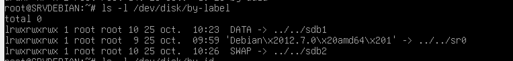

### Exercice 1 : Partition et Debian 12
#### Question 1
Aperçu des partitions et lancement de la commande pour créer de nouvelles partitions :  
  
Création des partions dans le ```/dev/sdb``` :  (avec à la fin un ```w``` pour sortir et écrire la table de partition)  
  
Désactivation du Swap de base :
  
Formatage des différentes partitions avec leur type et leur label :  
  
Activation du nouveau Swap :  
  
Les partitions avec leur label :  
  
Les partitions avec leur UUID :  
  
Les partitions avec leur type de système de fichier et leur taille :  
  

#### Question 2
Création du dossier et lancement de la commande pour modifier le fichier ```/etc/fstab``` :  
  
Modification du fichier en question :  
  
Vérification du montage grâce à ```mount -a```.  
  
